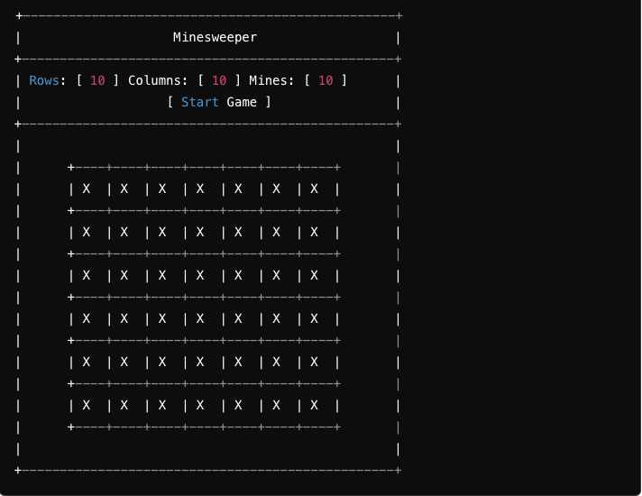

# my-game-minesweeper
my-game-minesweeper

<!-- By the end of this guide, you will have a functional Minesweeper game that runs in a web browser. The implementation is divided into three parts: HTML for the structure, CSS for styling, and JavaScript for the game logic. Each part will be explained in detail, along with inline comments to help you understand the code.

Explanation!
HTML Structure:
We define a calculator container with a display and buttons for digits, operators, clear, and equals.

CSS Styling:
The body is styled to center the calculator on the screen.
The calculator is given a clean look with a white background, shadow, and rounded corners.
Buttons are styled with different colors for digits, operators, and functions.

JavaScript Logic:
We use constants to select elements from the DOM.
Variables store the current input, the first number, the second number, and the operator.
Event listeners handle button clicks:
Numbers are appended to the input string.
Operators store the first number and prepare for the second input.
The clear button resets everything.
The equals button performs the calculation and displays the result.
Functions handle displaying values and performing calculations based on the selected operator.

Diagram!

 -->

# Minesweeper Game

Minesweeper is a classic logic-based game where the player must clear a grid of hidden mines without triggering any of them. The game provides clues about the number of mines in adjacent cells, which helps the player deduce the locations of the mines. This guide will walk you through the implementation of the classic Minesweeper game using HTML, CSS, and JavaScript. This implementation covers the setup of the game board, mine placement, revealing cells, marking cells, and checking for win conditions.

## Screenshot

## Technologies Used

- JavaScript
- HTML
- CSS
- CardStarter CSS Library

## Getting Started

[Click to Play Minesweeper!](https://olayusuf22.github.io/my-game-minesweeper/)
